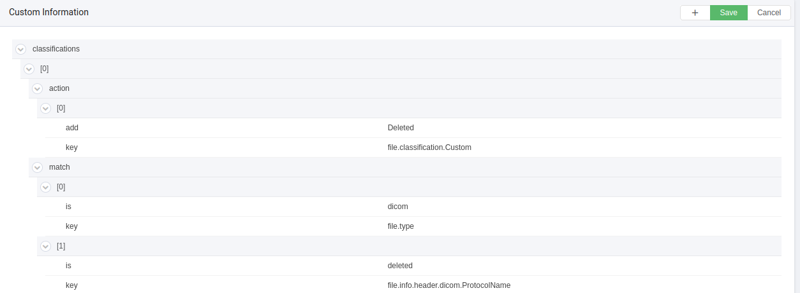

<!-- markdownlint-disable code-block-style -->
# File Classifier

[[_TOC_]]

## Overview

The file classifier gear provides a gear interface to the
[fw-classification](https://gitlab.com/flywheel-io/public/fw-classification) toolkit
and is essentially just a wrapper around fw-classification.

For documentation on classification in general, please consult the
[fw-classification documentation](https://flywheel-io.gitlab.io/public/fw-classification/fw-classification/)

The file classifier gear uses the file type of the provided input to determine
the proper
[adapter](https://flywheel-io.gitlab.io/public/fw-classification/fw-classification/fw-classification/adapters/)
to use.

## Supported file types

Currently the gear supports classification of the following file types:

* `dicom`: via the `file.info.header.dicom` namespace which is populated using
the
[file-metadata-importer](https://gitlab.com/flywheel-io/flywheel-apps/file-metadata-importer)
gear.
* `nifti`: via a `json` sidecar which is found in the same container as the
input.

## Usage

### Prerequisites

#### Metadata

In general, since fw-classification acts on input metadata, the input file needs to have
it's metadata populated before running file-classifier. The metadata can live in a few
places depending on how the file will be classified.  The most common would be in the
`file.info.header.<file-type>` which will be populated by `file-metadata-importer`.  But
the metadata can also be in a separate file such as the `sidecar.json` for NIfTIs, or in
the hierarchy such as acquisition label, file name, or custom information on any parent
container.

#### Profile

file-classifier ships with [default
profiles](https://gitlab.com/flywheel-io/public/fw-classification/fw-classification-profiles/-/tree/main/profiles)
but the gear also accepts an input profile.  If you have custom needs beyond what is in
the default profile, you will need to override the default profiles. See [Custom
Classifications](#custom-classifications)

### Inputs

* __file-input__: The file to classify
* __profile__: Optional profile to use for classification, if passed in, this
will override the default classification profile and use what was passed in.
See documentation for creating a profile at the
[classification-toolkit
docs](https://flywheel-io.gitlab.io/public/fw-classification/fw-classification/fw-classification/profile/)
* __classifications__: An optional list of context classifications set at the
project level, see
[Setting custom classifications](#custom-classifications).  These
classifications are added as the final block to the profile that is being
used to classify, therefore they get highest priority.

### Configuration

* __debug__ (boolean, default False): Include debug statements in output.
* __tag__ (str, default 'file-classifier'): String to tag the file after
classification. Useful for gear-rule pipelines triggered by tags.

### Which profile will be used?

The priority for determining which profile will be used is as so:

1. Profile passed in via the optional _input_ `profile`
2. Default profile `main.yml` described in the
[classification-profiles](https://gitlab.com/flywheel-io/public/fw-classification/fw-classification-profiles)
repo.

The profile being used will be printed out at the beginning of the gear.

!!! note
    _After_ the profile has been determined, context classifications will be
    added as a block to that profile, i.e. context-classifications _always_ have the
    highest priority.

## Custom Classifications

Often the default profile will not have specific enough classification for a specific
project.  If you need to add custom classifications, there are two main ways to pass
them in:

1. Create a profile and attach it to your project
2. Add custom classifications to the project custom information.

### Create a profile

This is a better option if you will use these same custom classifications on multiple
projects.

__WARNING__:

> Creating a profile and passing it in as input will _completely_ bypass the already
> pre-defined classifications, so if you want to keep those, you will need to either copy
> them, or include as a git profile:

For example, to add a custom classification of `Deleted` when Protocol Name has been
deleted:

```yaml
---
name: Custom classifier
includes:
  # Include default MR
  - https://gitlab.com/flywheel-io/public/fw-classification/fw-classification-profiles$profiles/MR.yaml

profile:
  - name: set_custom_deleted
    description: |
      Set custom deleted classification if ProtocolName was deleted
    rules:
      - match_type: 'all'
        match:
          - key: file.type
            is: dicom
          - key: file.info.header.dicom.ProtocolName
            is: 'Deleted'
        action:
          - key: file.classification.Custom
            add: 'Deleted'
```

### Add custom classifications to project information

Custom classification can be added to project information.  These can be added either
via the SDK or UI, and they follow the same structure as a `fw-classification` profile
[block](https://flywheel-io.gitlab.io/public/fw-classification/fw-classification/fw-classification/profile/#block).

!!! note

    Project information classifications are added _fter_ the profile has been
    determined, context classifications will be added as a block to that profile, i.e.
    context-classifications always have the highest priority.

For example, adding the same `ProtocolName` block via the SDK:

```python
import flywheel
fw = flywheel.Client()
proj = fw.get_project(<proj_id>) # or use lookup()
existing_info = proj.info
# Initialize context classifications if they don't exist
existing_info.setdefault('classifications', [])
existing_info['classifications'].append(
    {
        'match': [
            {
                'key': 'file.type',
                'is': 'dicom',
            },
            {
                'key': 'file.info.header.dicom.ProtocolName',
                'is': 'deleted',
            }
        ],
        'action': [
            {'key': 'file.classification.Custom', 'add': 'Deleted'},
        ]
    }
)
proj.replace_info(existing_info)
```

The gear will then record that it found these custom classifications in the job logs:

```bash
...
[552ms   INFO     ]  Log level is INFO
[552ms   INFO     ]  Using default profile 'main.yml'
[1152ms   INFO     ]  Looking for custom classifications in project Q1_Q2_2022
[1152ms   INFO     ]  Found custom classification in project context, parsed as:

If all of () executed, then execute the first match of the following:

        -------------------- Rule 0 --------------------
        Match if Any are True:
                - file.type is dicom
                - file.info.header.dicom.ProtocolName is deleted

        Do the following:
                - add Deleted to file.classification.Custom

[1152ms   INFO     ]  Starting classification.
[1380ms   INFO     ]  Running at acquisition level
...
```

You can also add these values via the UI:



## Contributing

For more information about how to get started contributing to that gear,
checkout [CONTRIBUTING.md](CONTRIBUTING.md).
